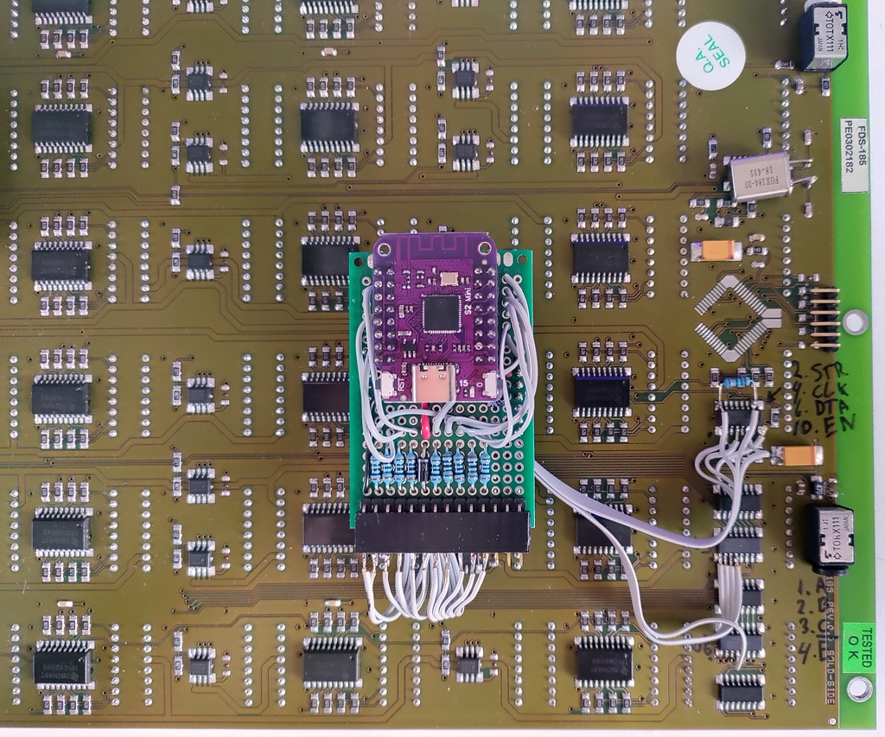
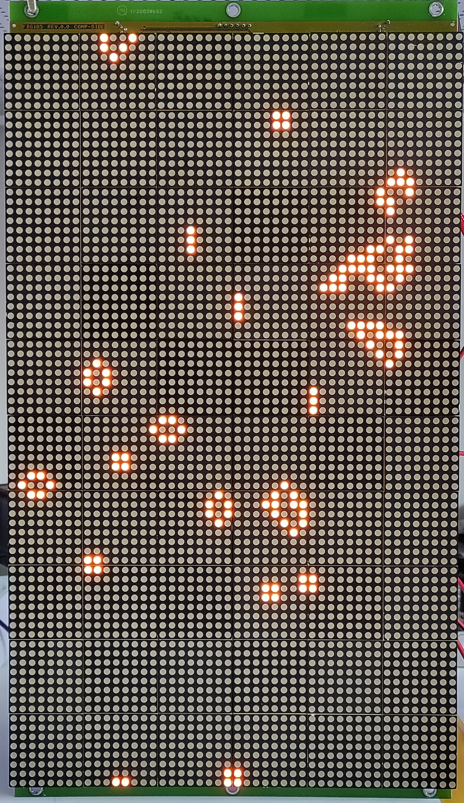

Hi there!

# ESP32-S2 mini

Experiment if the [ESP32-S2](ESP32-S2/) will drive the FDS-185 LED matrix. It does, but there is some jitter. Not happy yet with that result.

For now its good enough™

# Atmega328p

In [this directory](Atmega328p/) you can find some test code to drive the FDS-185 LED matrix that was made by Surtronic BV. I bought some panels second hand from [Baco Army Goods](https://www.baco-army-goods.nl/).

You can find the schematic PDF of a similar LED matrix (the FDS-184) here: https://www.circuitsonline.net/forum/view/message/1487359#1487359
The difference for the FDS-185 is that it contains more shift registers (30 instead of 24).

You must desolder the Lattice PLD and solder some wires to the chip U1 for the SPI signals and U3+U6 for the row select signals.

The code was made in Atmel Studio 6.1 and works on a ATMEGA328P and displays some patterns.

